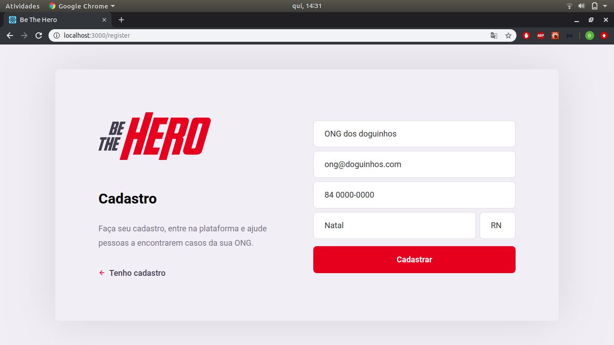
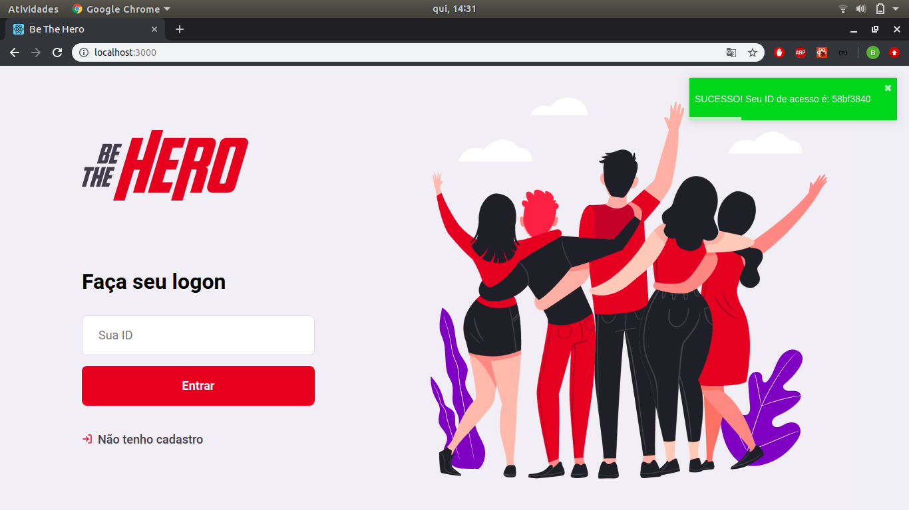
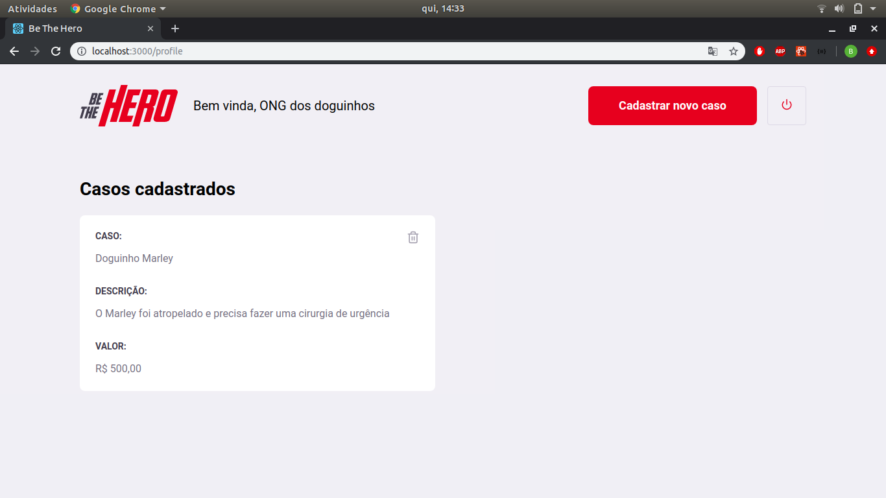

<h4 align="center">
 
 
</h4>

  
  

 

### :rocket: Technologies used
This project was developed with the following technologies:
- [Node.js](https://nodejs.org/en/)
  - [Express](https://expressjs.com/pt-br/)
  - [Knex](http://knexjs.org/)
- [React](https://pt-br.reactjs.org/)
- [React Native](https://reactnative.dev/)

### :computer: Project

<b>Be the Hero</b> is a project that aims to connect <b>ONGS</b> and people interested in help financially cases of each <b>ONG</b>.

### :boom: Results
- #### Register Screen

   

- #### Logon Screen

   

- #### Incidents Screen

   

- #### New Incident Screen

   

### - :repeat: How to contribute

- Fork this repository;
- Create a branch: `git checkout -b my-branch`
- Make a commit with yours changes: `git commit -m 'feat: My new feature'`
- Push your branch: `git push origin my-branch`
- Create pull request;

### :memo: License

The project is licensed under MIT. See [LICENSE](LICENSE.md) file for the full license.
